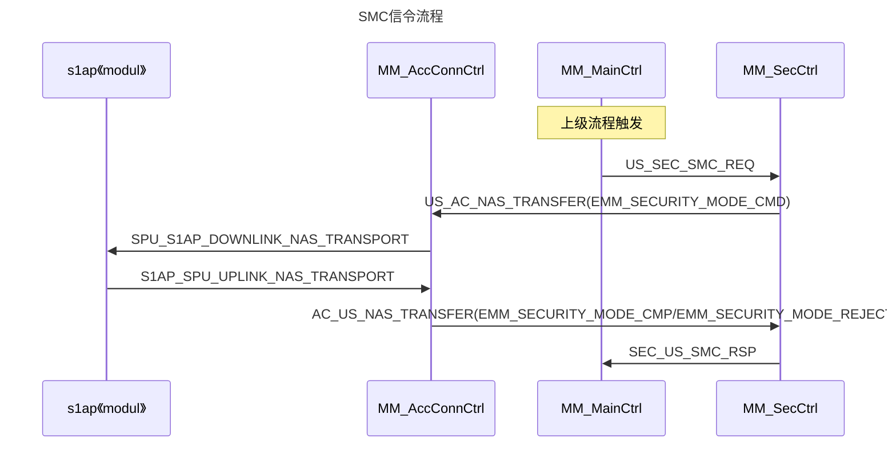
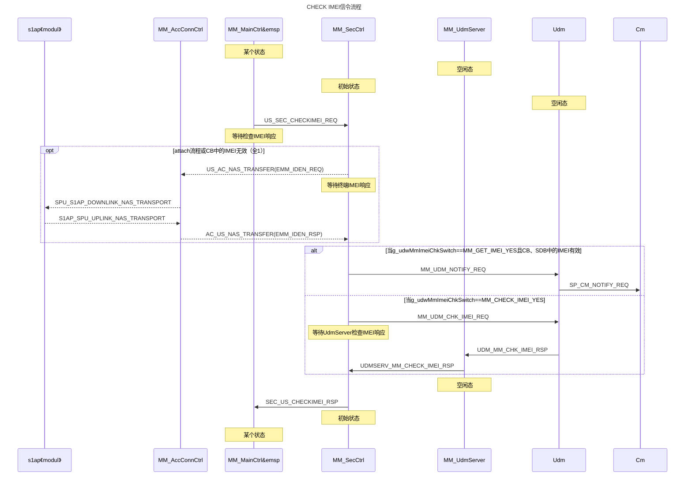
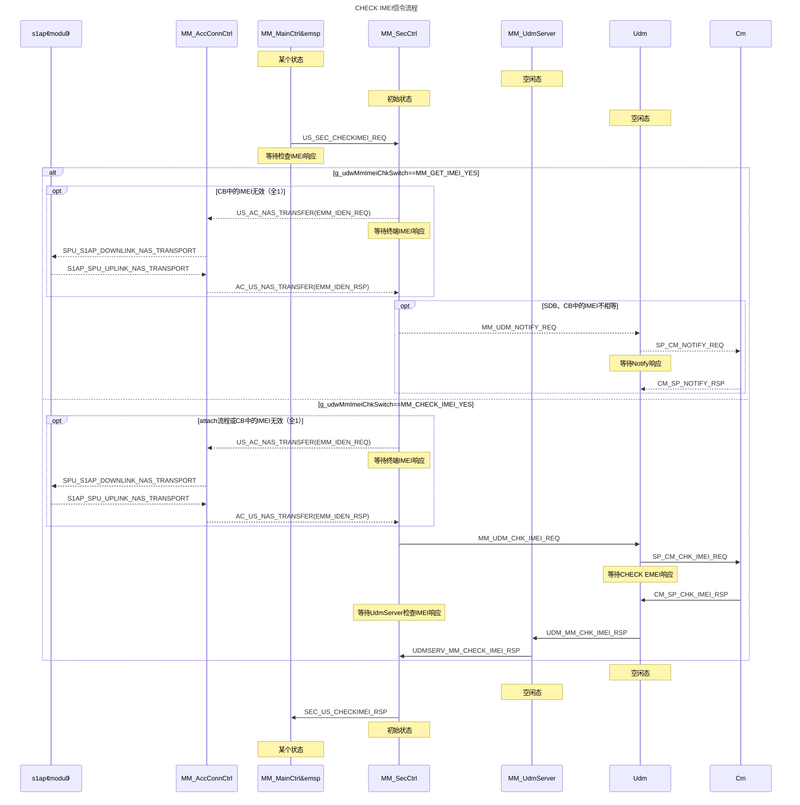
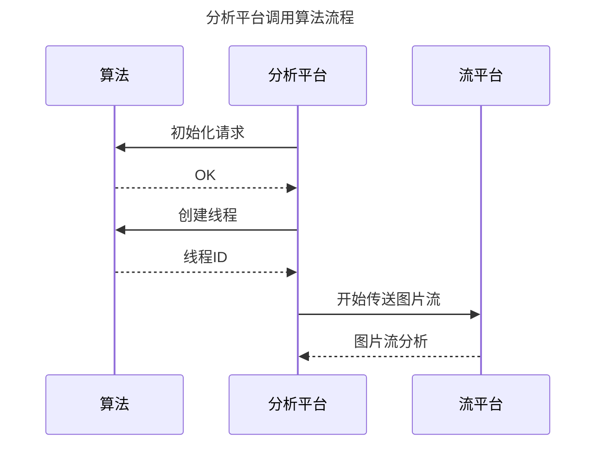

------

***<font color=blue>版权声明</font>：<font color=red>未经作者允许</font>，<font color=blue>严禁用于商业出版</font>，<font color=red>否则追究法律责任。转载请注明出处！！！</font>***

------

# 1 SMC
```mermaid!
sequenceDiagram
title: 序列图sequence(示例)
participant A
participant B
participant C
participant D as test

note left of A: A左侧说明
note over B,C: 覆盖B,C的说明
note right of C: C右侧说明

A->A:自己到自己
A->B:实线不带箭头
A-->B:虚线不带箭头
A->>B:实线带箭头
A-->>B:虚线带箭头
A-xB:带x带箭头实线（异步）
A--xB:带x带箭头虚线（异步）
C->D:激活
activate C
C->D:不激活
deactivate C

C->+D:激活
C->+D:激活
C->-D:不激活
C->-D:不激活

loop 循环
B->C:测试循环
B->>C:测试循环
B-->C:测试循环
B-->>C:测试循环
end

A->>D:首选路径

alt 替代路径1
A->>C: 
C->>D: 
else 替代路径2
A->>B: 
B->>D: 
end

A-->>C: 首选路径

opt 一种替代路径
A-->>B: 
B-->>D: 
end
```
## 1.1 信令流程


# 2 CHECK IMEI
## 2.1 信令流程

U-->>S:UDM_MM_NOTIFY_RSP(发送给MM模块)
# test



# main

# rw
```shell


```
------

***<font color=blue>版权声明</font>：<font color=red>未经作者允许</font>，<font color=blue>严禁用于商业出版</font>，<font color=red>否则追究法律责任。转载请注明出处！！！</font>***

------
