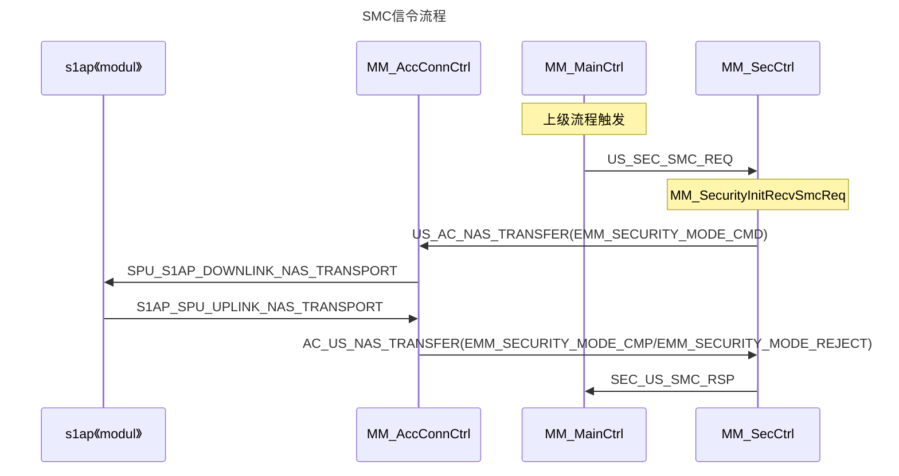

------

***<font color=blue>版权声明</font>：<font color=red>未经作者允许</font>，<font color=blue>严禁用于商业出版</font>，<font color=red>否则追究法律责任。转载请注明出处！！！</font>***

------

# 1 SMC流程

## 1.1 信令流程



```mermaid!
sequenceDiagram

title: CHECK EMEI信令流程
participant s1 as s1ap《modul》
participant A as MM_AccConnCtrl
participant M as MM_MainCtrl&emsp;
participant S as MM_SecCtrl
participant U as MM_UdmServer

note left of M: 上级流程触发
note over S: MM_SECURITY_INIT
M->>S:US_SEC_CHECKEMEI_REQ
note over M:WAIT_CHECKIMEI_RSP
opt:
S-->>A:US_AC_NAS_TRANSFER(EMM_IDEN_REQ)
A-->>s1:SPU_S1AP_DOWNLINK_NAS_TRANSPORT
s1-->>A:S1AP_SPU_UPLINK_NAS_TRANSPORT
A-->>S:AC_US_NAS_TRANSFER(EMM_SECURITY_MODE_CMP/EMM_SECURITY_MODE_REJECT)
S->>M:SEC_US_SMC_RSP
```


------

***<font color=blue>版权声明</font>：<font color=red>未经作者允许</font>，<font color=blue>严禁用于商业出版</font>，<font color=red>否则追究法律责任。转载请注明出处！！！</font>***

------
