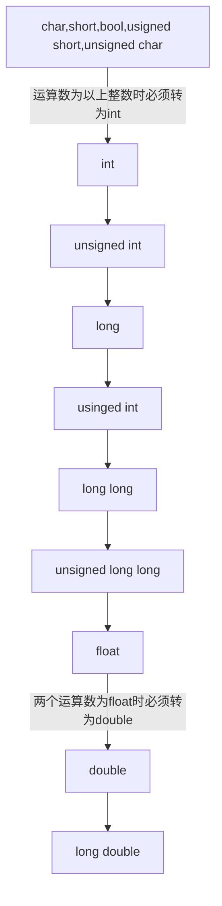

------

***版权声明：未经作者允许，严禁用于商业出版，否则追究法律责任。转载请注明出处！！！***

------

# 1 隐式转换
## 1.1 算术转换

* 低于int的整型变量运算时全部转为int，结果为int
* 两个float变量运算转为double，结果为double
* 两个运算数不同类型时按下图顺序，将二者中低精度转为高精度的，结果为高精度的类型

## 1.2 赋值转换
在赋值运算中，赋值号两边操作数的数据类型不同时，赋值号右边的操作数类型将转换为左边操作数的类型。 

* 浮点转浮点：高精度转为低精度可能丢失精度
* 整型转整型：直接复制低n位，n为更短的长度，其余高位丢弃
* 整型与浮点：不推荐做这样的转换，以十进制来看，一般为小数部分的丢失和添加。

* 常量（指的字面量，非常变量）的默认转换类型：
  * 整型常量的默认数据类型是int类型
  * 浮点数常量的默认类型是double类型

## 1.3 函数调用转换
如果实参与形参的数据类型不同，则将实参的数据类型转为实参的数据类型，转换规则与赋值转换的规则相同。
## 1.4 输出转换
如果与指定的数据类型不同，转为指定的数据类型后输出，转换规则与赋值转换的规则相同。

## 1.5 类转换
C++中当派生类对象赋值给基类对象 、实参是派生类而形参是基类时，派生对象可以隐式转换为基类对象。

>注意:
>（1）C++ 中任意类型的指针可以隐式转为void*，但void*不可以隐式转换为其他类型，
>（2）C++ 中派生类指针可以隐式的转为基类指针。

# 2 强制转换
在C中使用`（type）expr`;
在C++中使用`cast_name<type>(expr)`,其中cast_name有四种:
  * static_cast
  * const_cast
  * dynamic_cast
  * reinterpret_cast
 

------

***版权声明：未经作者允许，严禁用于商业出版，否则追究法律责任。转载请注明出处！！！***

------
