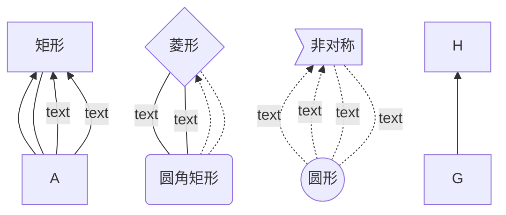
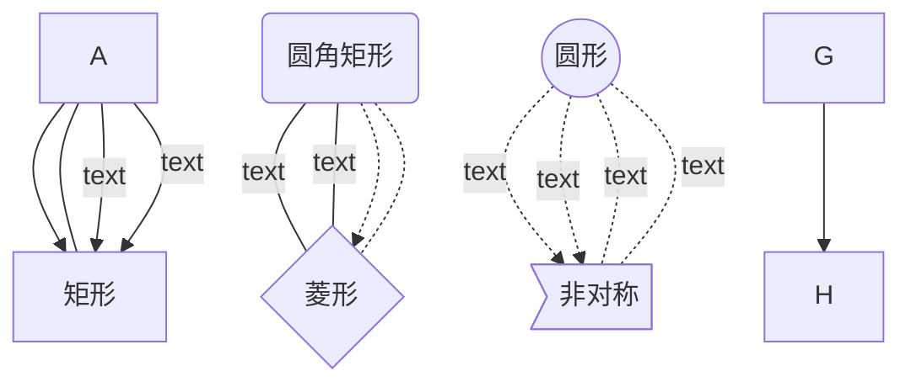
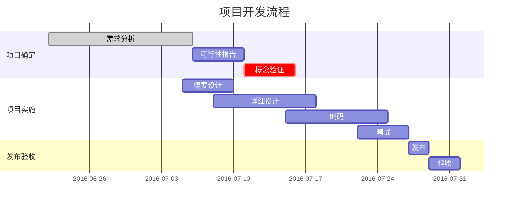
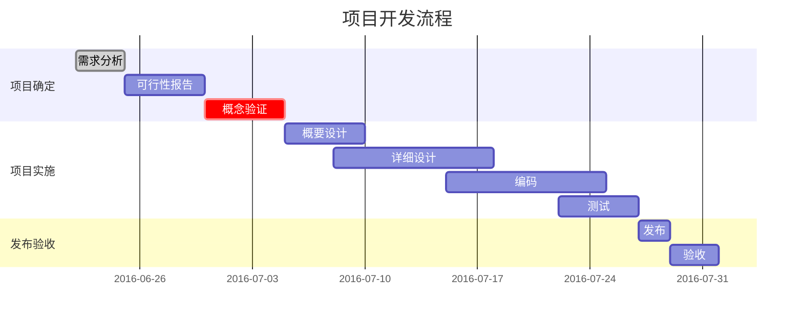

------

&emsp;&emsp;<font color=blue>**_版权声明_**</font>：本文章参考了<font color=blue >《小书匠markdown 官方教程》。</font><font color=red>未经作者允许，<font color=blue>严禁用于商业出版</font>，否则追究法律责任。网络转载请注明出处，这是对原创者的起码的尊重！！！</font>

------


# 1 基本语法
## 1.1 转义
&emsp;&emsp; 右斜线`\`表示转义，markdown中标记字符`[、 \、  *、`、$`都需要加上转义符号才能使用原字符。

## 1.2 标题
&emsp;&emsp;`# h`表示一级标题
&emsp;&emsp;`## h`加空格表示二级标题
&emsp;&emsp;`### h`加空格表示三级标题
&emsp;&emsp;`#### h`加空格表示四级标题
&emsp;&emsp;`##### h`加空格表示五级标题 
&emsp;&emsp;`###### h`加空格表示六级标题

&emsp;&emsp;**注意：**只有当`#`位于**一行开头，或引用文字中的一行开头**的才会起作用。
&emsp;&emsp;**注意：**#与标题之间要有空格，在标准的markdown规范中必须要有空格**的才会起作用。

## 1.3 加粗和斜体
&emsp;&emsp;一个`*`或`_`环绕表示斜体，如`*斜体*`， 显示效果：*斜体*。
&emsp;&emsp;两个`*`或`_`环绕表示加粗，如`**加粗**` ，显示效果：**加粗**。
&emsp;&emsp;三个`*`或`_`环绕或混用`*`和`_`表示粗斜体，如`***粗斜体***`，显示效果：***斜体***。

## 1.4 删除线和分行线
&emsp;&emsp;两个  `~`环绕表示删除线，如`~~删除线~~`，显示效果：~~删除线~~
&emsp;&emsp;三个  \* 或 \+或 \-表示一条横线，如`***`，显示效果：

----

## 1.5 引用

>* 用`>`表示引用。
>* 对一段话引用只需在开头使用一次。 
>* 引用中可以使用**标题**，**粗体**、*斜体*、***粗斜体***、~~删除线~~、`代码`、`代码块`、公式、有序或无序列表。
>*  引用中可以使用**链接、图片、跳转、表格**，在支持注脚的版本中也可以使用注脚。
>*  可以多层引用
>>  |名字|年龄|
>>  |---|---|
>>  | 张三|10|
>> 
>>  [使用链接,该链接连接到百度](https://www.baidu.com "跳转到百度")
>```c
>include<stdio.h>//引用代码块
>int i=1;
>```


## 1.6 无序列表
* *或+或-，分别加空格表示无序列表
	* 每级缩进一个TAB   
		* 3. 可以多层列表
		* 2. 可以嵌套列表

## 1.7 有序列表
1. 有序列表用**序号.加空格**表示，
2. 一个TAB为一级缩进
2. 有序列表每一级都会重新开始排序
	3. 有序列表显示的是实际的序号与输入的序号无关，
3. 2. 可以多层列表，
4. * 可以嵌套列表 

>**注意**：大部分情况下，1个TAB，一个空格或两个或三个空格都能正确缩进，但是有些编辑器却无法解析一个空格。所以推荐使用TAB。


## 1.8 链接与图片
* 链接有三种方式:
	1. **行内式**：`[描述文字](链接地址 “悬停提示")` 
	2. **参考式**：`[描述文字][id]` ，在任何地方使用 `[id](链接地址 “悬停提示")`，可以省略id，省略id表示id为描述文字，
	3. **直接链接**：`<完整链接地址>`，如：<https://www.baidu.com>
* 图片的语法和链接前两种语法一致，只是在开头需要加上一个英文的感叹号 `!`，表示这是图片。如：``

## 1.9 语法嵌套
&emsp;&emsp;<span id=‘test’>所有可在行内使用的语法都可以在其他语法中套用，比如 加粗 可在标题中使用。</span>


## 1.10 代码和代码块
*  句内代码用 \` 代码 \`表示，例如:`int a=2`
* 代码块的每一行用四个空格或一个tab开头


## 1.11 HTML标签
* 只要支持GFM的markdown都兼容html标签

# 2 扩展语法
|markdown版本|cmd|csdn|xiaoshujiang|
|--|--|--|--|
|任务列表|支持|支持|支持|
|数学公式|支持|支持|支持|
|加强代码块|支持|支持|支持|
|代码块设置行号|||支持|
|目录|支持|支持|支持|
|思维导图目录|||支持|
|脚注|支持|支持|支持|
|缩进|支持|支持|支持|
|下划线|不支持|支持|支持|
|文字高亮|不支持|支持|支持|
|页内跳转|支持|||
|锚点跳转||支持|支持|
|标签|支持||支持|
|字体、颜色、大小||支持|支持|
|视频|||支持|
|音频|||支持|
|附件|||支持|
|段代码文字格式|||支持|
|流程图|支持|支持|支持|
|序列图|支持|支持|支持|
|统计图|||支持|
|mermaid 流程图 序列图 甘特图|支持|支持|支持|
|html|支持|支持|支持|
|思维导图|||支持|
## 2.1 任务列表
任务列表,`- [] 任务`表示未完成`- [X] 任务`表示已完成， 任务列表也支持多级使用。
```markdown
-  [ ] 未完成
-  [x] 已完成
-  [X] 已完成
```
显示效果：

-  [ ] 未完成
-  [x] 已完成
-  [X] 已完成


## 2.2 增强代码块

* 在行首使用 \` \` \`代码块 \` \` \`表示代码块，在第一行的三个\` \` \` 后面可以添加对应语言关键字来实现语法高亮，此时语言关键字后面不需要加感叹号`！`，如：
````markdown
```cpp 
int a = 10 ;
int b = 20; 

```
````
显示如：
```cpp
  int a = 10 ;
  int b = 20;
```
* 支持是否显示行号，默认会显示：
````markdown
```语言关键字?linenums[=true|false]
... ...
... ...

```
````

* 支持设置起始行号：
````markdown
```语言关键字?linenums=起始行号
... ...
... ...

```
````
*  单独高亮某些行：
````markdown
```语言关键字?linenums&fancy=行号列表
... ...
... ...

```
````


|语言|关键字|语言|关键字|
|--|--|--|--
|AppleScript|	applescript|普通文本|text , plain
|ActionScript 3.0|	actionscript3 , as3|Python|	py , python|
|Shell	|bash , shell|Ruby|	ruby , rails , ror , rb
|ColdFusion	|coldfusion , cf|SASS&SCSS|	sass , scss
|C|	cpp , c|Scala|	scala
|C#	|c# , c-sharp , csharp|SQL|	sql
|CSS|	css|Visual Basic|	vb , vbnet
|Delphi|	delphi , pascal , pas|XML|	xml , xhtml , xslt , html
|diff&patch|	diff patch|Objective C|	objc , obj-c
|Erlang|	erl , erlang|F#	|f# f-sharp , fsharp
|Groovy|	groovy|R|	r , s , splus
|Java|	java|matlab|	matlab
|JavaFX|	jfx , javafx|swift|	swift
|JavaScript	|js , jscript , javascript|GO	|go , golang
|Perl|	perl , pl , Perl
|PHP|	php

* 增强代码块还支持根据特定的命令关键字实现特定的功能。此时，关键字后要加上感叹号`！`

|命令关键字|作用|
|--|--|
|mathjax|数学公式|
|flow|流程图|
|plot|统计图|
|sequence|序列图|
|mermaid|mermaid流程图、序列图、甘特图
|mindmap|思维导图


## 2.3 生成目录
 * 可以在**新行**用 `[TOC]`生成目录。如：

[TOC]


* 支持显示成思维脑图大纲:`[toc!]`,显示如下：


* 支持带参数 depth, 显示最深到几层`[toc!?depth=2]`，显示如下：


## 2.4 页内跳转
* **页面跳转**： `[页内跳转](#页内文字)`，比如：`[跳到开头](#基本语法)`，显示如下：


*  **锚点跳转**:这是html 的语法， `<span id='idname'>跳转文字</span>`设置锚点，在其他地方就可以使用`[跳转处](#idname)` 跳转。例如：[跳转](#test)

## 2.5 缩进
缩进使用html的语法`&emsp;`表示缩进一个中文字符；`&ensp;`表示缩进一个英文字符。

## 2.6 脚注

脚注语法: `内容[^id] ` ，然后在任意行首使用  `[^id]:脚注内容`。

## 2.7 文字格式

* **下划线**：`++文本++`表示下划线 ，如：++文本++
* **文本高亮**：`==文本==`来做颜色标记，如： ==文本==
* **上标文字**
	* `文字^上角^`，显示如：文字^上角^
	*  `文字<sup>上角</sup>`，显示如：文字<sup>上角</sup>
* **文字下标**
	* `文字~下角~`，显示如：文字~下角~
	* `文字<sub>下角</sub>`，显示如：文字<sub>下角</sub>
* **对齐**
	* 文字左对齐: `:>文字居左<-`
	* 文字右对齐: `->文字居右<:`
	* 文字两端对齐: `:>两端对齐的文字<:`
	* 文字居中: `->文字居中<-`

* **字体、颜色、大小**：用`<font face="字体名" size=大小 color=颜色>文本内容</font>`来设置字体、颜色、大小。
*  **段代码文字格式** 
    * `var >>~~hello~~<< = 'hello world'`
  	* `var >>==hello==<< = 'hello world'`
 	* `var >>**hello**<< = 'hello world'`
 	* `var >>++hello++<< = 'hello world'`

	* 显示如下：


## 2.8 标签
标签分类，在新行使用`tags：标签1 标签2...`或`TAGS：标签名 标签2...`，可以给文章贴上标签。


## 2.9 多媒体
* 音频：`~[文件名](URL)`
* 视频: `%[文件名](URL)`
* 附件: `=[文件名](URL)`


## 2.10 LaTeX数学公式
### 2.10.1 基本语法

* `$数学公式$`——表示行内数学公式，如` $a^+b^2 $`,显示效果： $a^2+b^2$；
* `$$数学公式$$`—— 表示整行数学公式，如`$$a^2+b^2 =c^2$$`，显示效果：$$a^2+b^2 =c^2$$

* xiaoshujiang markdown支持另一种写法：
````markdown
```mathjax!
数学公式1
数学公式1
数学公式1
```
````
### 2.10.2  公式对齐
* `\begin{align} ... \end{align}`，使用&表示对齐位置，\\\表示换行，\tag{n}标签序号。


```markdown
$$
\begin{align}
h(x) =& \frac{1}{\int_xt(x)\mathrm{d}x} \tag{1} \\
=& \frac{1}{\int_x\eta(x)\mathrm{d}x}g(x)\tag{2}
\end{align}
$$
```

&emsp;&emsp;显示如下：


* `\begin{eqnarray} ...\end{eqnarray}`，使用&表示对齐位置


```markdown
$$
\begin{eqnarray}
a & = & b + c \\
& = & d + e + f + g + h + i + j + k + l\\
&& +\: m + n + o \\
& = & p + q + r + s
\end{eqnarray}
$$
```
&emsp;&emsp;显示如下：


### 2.10.3  矩阵

* 简单矩阵—— `$$\begin{matrix}…\end{matrix}$$`来生成矩阵，其中... 表示的是LaTeX 的矩阵命令，矩阵命令中每一行以  \   \\ 结束，矩阵的元素之间用&来分隔开。
```markdown
 $$
  \begin{matrix}
   1 & 2 & 3 \\
   4 & 5 & 6 \\
   7 & 8 & 9
  \end{matrix} \tag{1}
$$
```
&emsp;&emsp;显示如：
 $$
  \begin{matrix}
   1 & 2 & 3 \\
   4 & 5 & 6 \\
   7 & 8 & 9
  \end{matrix} \tag{1}
$$


* 带括号的Matrix——可以给矩阵加上括号，分为两种：使用`\left矩阵左括号 ... \right矩阵右括号 `(其中花括号要进行转义)或者把公式命令中的matrix 改成 `pmatrix（圆括号）、bmatrix（方括号）、Bmatrix（花括号）、vmatrix（行列式）、Vmatrix（双竖线）`等。
```markdown
$$
 \left\{
 \begin{matrix}
   1 & 2 & 3 \\
   4 & 5 & 6 \\
   7 & 8 & 9
  \end{matrix}
  \right\} \tag{2}
$$
```
&emsp;&emsp;显示如下：
$$
 \left\{
 \begin{matrix}
   1 & 2 & 3 \\
   4 & 5 & 6 \\
   7 & 8 & 9
  \end{matrix}
  \right\} \tag{2}
$$
```markdown
$$
 \begin{pmatrix}
   1 & 2 & 3 \\
   4 & 5 & 6 \\
   7 & 8 & 9
  \end{pmatrix} \tag{4}
$$
```
&emsp;&emsp;显示如下：
$$
 \begin{pmatrix}
   1 & 2 & 3 \\
   4 & 5 & 6 \\
   7 & 8 & 9
  \end{pmatrix} \tag{4}
$$
```markdown
$$
 \begin{bmatrix}
   1 & 2 & 3 \\
   4 & 5 & 6 \\
   7 & 8 & 9
  \end{bmatrix} \tag{5}
$$
```
&emsp;&emsp;显示如下：
$$
 \begin{bmatrix}
   1 & 2 & 3 \\
   4 & 5 & 6 \\
   7 & 8 & 9
  \end{bmatrix} \tag{5}
$$
```markdown
$$
 \begin{Bmatrix}
   1 & 2 & 3 \\
   4 & 5 & 6 \\
   7 & 8 & 9
  \end{Bmatrix} \tag{5}
$$
```
&emsp;&emsp;显示如下：
$$
 \begin{Bmatrix}
   1 & 2 & 3 \\
   4 & 5 & 6 \\
   7 & 8 & 9
  \end{Bmatrix} \tag{5}
$$
```markdown
$$
 \begin{vmatrix}
   1 & 2 & 3 \\
   4 & 5 & 6 \\
   7 & 8 & 9
  \end{vmatrix} \tag{5}
$$
```
&emsp;&emsp;显示如下：
$$
 \begin{vmatrix}
   1 & 2 & 3 \\
   4 & 5 & 6 \\
   7 & 8 & 9
  \end{vmatrix} \tag{5}
$$
```markdown
$$
 \begin{Vmatrix}
   1 & 2 & 3 \\
   4 & 5 & 6 \\
   7 & 8 & 9
  \end{Vmatrix} \tag{5}
$$
```
&emsp;&emsp;显示如下：
$$
 \begin{Vmatrix}
   1 & 2 & 3 \\
   4 & 5 & 6 \\
   7 & 8 & 9
  \end{Vmatrix} \tag{5}
$$

* 带省略符号的矩阵——如果矩阵元素太多，可以使用\cdots \ddots \vdots 等省略符号来定义矩阵。
```markdown
$$
\left[
    \begin{matrix}
        1      & 2      & \cdots & 4      \\
        7      & 6      & \cdots & 5      \\
        \vdots & \vdots & \ddots & \vdots \\
        8      & 9      & \cdots & 0      \\
    \end{matrix}
\right]
$$
```
&emsp;&emsp;显示如下：

$$
\left[
\begin{matrix}
 1      & 2      & \cdots & 4      \\
 7      & 6      & \cdots & 5      \\
 \vdots & \vdots & \ddots & \vdots \\
 8      & 9      & \cdots & 0
\end{matrix}
\right]
$$


* 带参数的矩阵——比如写增广矩阵，可能需要最右边一列单独考虑。可以用array命令来处理,其中\\begin{array}{cc|c}中的c表示居中对齐元素,|用来作为分割列的符号。
```markdown
$$ 
\left[
    \begin{array}{cc|c}
        1 & 2 & 3 \\
        4 & 5 & 6
    \end{array}
\right] \tag{7}
$$
```
&emsp;&emsp;显示如下：
$$ 
\left[
    \begin{array}{cc|c}
      1 & 2 & 3 \\
      4 & 5 & 6
    \end{array}
\right] \tag{7}
$$


* 行间矩阵——可以使用`\bigl(\begin{smallmatrix} ... \end{smallmatrix}\\bigr)`，
```markdown
 $\bigl( \begin{smallmatrix} a & b \\ c & d \end{smallmatrix} \bigr)$
```
&emsp;&emsp;显示如下：

### 2.10.4 数学符号
* 希腊字母——如果使用大写的希腊字母，把命令的首字母变成大写即可，例如 \Gamma 输出的是 $\Gamma$。如果使用斜体大写希腊字母，再在大写希腊字母的LaTeX命令前加上var，例如\varGamma 生成$\varGamma$。

|命令|	显示|命令|	显示|命令|	显示|命令|	显示|
|--|--|--|--|--|--|--|--|
|\alpha|$\alpha$|\beta|$\beta$|\gamma|$\gamma$|\delta|$\delta$|
|\epsilon|	$\epsilon$|	\zeta|$\zeta$	|\eta	|$\eta$	|	\theta|	$\theta$
|\iota	|$\iota$	|	\kappa|$\kappa$	|\lambda	|$\lambda$	|	\mu|$\mu$
|\xi|	$\xi$	|	\nu	|$\nu$|\pi|	$\pi$	|	\rho|	$\rho$
|\sigma|$\sigma$	|		\tau|$\tau$|\upsilon|	$\upsilon$|		\phi|$\phi$
|\chi|	$\chi$	|	\psi|	$\psi$|\omega|	$\omega$|	\ell|$\ell$|		
	

* 和号、积号、积分号、集合、极限

|命令|	显示	|	命令|	显示
|--|--|--|--|
|\sum|	$\sum$	|	\int|	$\int$
|\sum_{i=1}^{N}|$\sum_{i=1}^{N}	$|\int_{a}^{b}|	$\int_{a}^{b}$|
|\prod|	$\prod$|\iint|$\iint$
|\prod_{i=1}^{N}|$\prod_{i=1}^{N}$|	\iint_{a}^{b}|	$\iint_{D}$|
|\bigcup|$\bigcup$|		\iiint|	$\iiint$
|\bigcup_{i=1}^{N}|$\bigcup_{i=1}^{N}$|	\iiint_{a}^{b}|	$\iiint_{\bigcap}$|
|\bigcap|$\bigcap$|\lim|$\lim$|
|\bigcap_{i=1}^{N}|$\bigcap_{i=1}^{N}$|\lim_{x \to 0}	|$\lim_{x \to 0}$|


* 三角函数和双曲函数

|命令|	显示	|	命令|	显示|
|--|--|--|--|--|--|--|--|
|\sin x|$\sin x$|\cos x|$\cos x$|
|\tan x|$\tan x$|\cot x|$\cot x$|
|\sec x|$\sec x$|\csc x|$\csc x$
|\arcsin x|$\arcsin x$|\arccos x|$\arccos x$|
|\arctan x|$\arctan x$|
|\sinh x|$\sinh x$|\cosh x|$\cosh x$|
|\tanh x|$\tanh x$|\coth x|$\coth x$|


* 根号、上标、下标、分数、括号、空格

|命令|	显示|		命令|	显示|
|--|--|--|--|
|\sqrt[3]{2}|$\sqrt[3]{2}$|X^{3}	|$x^{3}$|
|\sqrt{2}|$\sqrt{2}$|x_{3}|	$x_3$|
|\frac{1}{2}	|$\frac{1}{2}$	|


* 特殊数学符号

|命令|	显示|		命令|	显示|
|--|--|--|--|
|\dot x|$\dot x$|\ddot x|$\ddot x$|
|\hat x|$\hat x$|\widehat {XYZ}|$\widehat {xyz}$|
|\bar x|$\bar x$|\overline {xyz}|$\overline {xyz}$|
|\vec x|$\vec x$|\overrightarrow {xyz}|$\overrightarrow {xyz}$|
|||\overleftrightarrow {xyz}|$\overleftrightarrow {xyz}$|


* 特殊符号

|命令|	显示|		命令|	显示|
|--|--|--|--|
|( )|$()$|[ ]|$[]$|
|\\{\ \}|$\{\}$|
|a\,b|$a\,b$|a\;b|$a\;b$|
|a\quadb|$a\quad b$|a\qquadb|$a\qquad b$|
|`\$`|$\$ $|\\_|$\_$|
|\backslash|$\backslash$|a\\\b|$a\\b$|
|{n+1 \choose 2k}|${n+1 \choose 2k}$|\binom{n+1}{2k}|$\binom{n+1}{2k}$|
|a\equiv b\pmod n|$a\equiv b\pmod n$|\tag x|$\tag x$|


* 其他符号

|命令|	显示|命令|	显示|命令|	显示|		命令|	显示|命令|	显示|
|--|--|--|--|--|--|--|--|--|--|
|\lt|$\lt$|\gt|$\gt$|\le|$\le$|\ge|$\ge$|\neq|$\neq$|
|\not\lt|$\not\lt$|\not\gt|$\not\gt$|\not\le|$\not\le$|\not\ge|$\not\ge$|
|\times|$\times$| \div|$\div$| \pm|$\pm$| \mp |$\mp$|\cdot{xy}|$\cdot$| 
|\cup|$\cup$| \cap| $\cap$|\setminus|$\setminus$| 
|\subset|$\subset$|\subseteq |$\subseteq$|\subsetneq |$\subsetneq$|
|\supset|$\supset$|\supseteq |$\supseteq$|\supsetneq |$\supsetneq$|
|\in| $\in$|\notin|$\notin$ |\emptyset |$\emptyset$|\varnothing|$\varnothing$
|\to |$\to$|\mapsto| $\mapsto$|
|\rightarrow| $\rightarrow$|\leftarrow|$\leftarrow$|\Rightarrow|$\Rightarrow$|\Leftarrow|$\Leftarrow$| 
|\land |$\land$|\lor|$\lor$| \lnot |$\lnot$|\forall |$\forall$|\exists |$\exists$|
|\top |$\top$|\bot|$\bot$| \vdash |$\vdash$|\vDash |$\vDash$|
|\star|$\star$| \ast|$\ast$| \oplus|$ \oplus$| \circ|$\circ$| \bullet |$\bullet$|
|\approx |$\approx $|\sim |$\sim$|\simeq|$\simeq$|\cong|$\cong$|\equiv|$\equiv$
|\prec|$\prec$| \lhd|$\lhd$| \rhd|$\rhd$|\Re|$\Re$ |\Im|$\Im$ |
|\infty|$\infty$|\aleph_0|$\aleph_0$|\nabla |$\nabla$|\partial|$\partial$| 
|\ldots|$\ldots$|\cdots|$\cdots$ |\ddots |$\ddots$|\vdots|$\vdots$|


* 字体

|命令|字体名|显示|
|--|--|--|
|\mathbb 或 \Bbb | blackboard bold |$\mathbb  {ABCDEFGH}$|
|\mathbf |boldface|$\mathbf {ABCDEFGH}$|
|\mathtt |typewriter|$\mathtt {ABCDEFGH}$|
|\mathrm |roman|$\mathrm {ABCDEFGH}$
|\mathsf | sans-serif |$\mathsf {ABCDEFGH}$
|\mathcal| calligraphic|$\mathcal {ABCDEFGH}$
|\mathscr| script letters|$\mathscr {ABCDEFGH}$
|\mathfrak| Fraktur|$\mathfrak {ABCDEFGH}$


* 分组：同一个元素如果有个多个普通字符，使用大括号括起来表示同组：`{a+b}`


## 2.11 序列图
* 定义序列图:
````markdown
```mermaid!
sequenceDiagram
... ...
... ...

```
	或

```sequence！
... ...
... ...

```
````
* 定义标题：`title: 标题`
* 定义对象（可以省略）：`participant 对象 [as 别名]`
* 定义注释：`note [left of|right of|over]  对象：注释 `
	* left of, 表示当前对象的左侧
	* right of, 表示当前对象的右侧
	* over, 表示覆盖在当前对象（们）的上面
* 定义动作：`对象1 箭头 对象2:内容`
	* -> 不带箭头的实线
	* --> 不带箭头的虚线
   * ->> 带箭头的实线
   * -->>	带箭头的虚线
   * -x 带x带箭头实线 (异步)
   * --x	带x带箭头虚线(异步)
* 激活/不激活：
	* 第一种：`activate|deactivate  对象 `
	* 第二种：定义动作时在对象2之前加`+`表示激活，加`-`表示不激活
* 循环：
```shell
loop Loop-text
... statements ...
end
```
* 替代路径alt或opt：
```shell
#如果有两条替代路径
alt Describing text
... statements ...
else Describing text
... statements ...
end

#如果只有一条替代路径
opt Describing text
... statements ...
end
```
* 示例
````markdown
```mermaid!
sequenceDiagram
title: 序列图sequence(示例)
participant A
participant B
participant C
participant D as test

note left of A: A左侧说明
note over B,C: 覆盖B,C的说明
note right of C: C右侧说明

A->A:自己到自己
A->B:实线不带箭头
A-->B:虚线不带箭头
A->>B:实线带箭头
A-->>B:虚线带箭头
A-xB:带x带箭头实线（异步）
A--xB:带x带箭头虚线（异步）
C->D:激活
activate C
C->D:不激活
deactivate C

C->+D:激活
C->+D:激活
C->-D:不激活
C->-D:不激活

loop 循环
B->C:测试循环
B->>C:测试循环
B-->C:测试循环
B-->>C:测试循环
end
A->>D:首选路径
alt 替代路径1
A->>C: 
C->>D: 
else 替代路径2
A->>B: 
B->>D: 
end
A-->>C: 首选路径
opt 一种替代路径
A-->>B: 
B-->>D: 
end
```
````

```mermaid!
sequenceDiagram
title: 序列图sequence(示例)
participant A
participant B
participant C
participant D as test

note left of A: A左侧说明
note over B,C: 覆盖B,C的说明
note right of C: C右侧说明

A->A:自己到自己
A->B:实线不带箭头
A-->B:虚线不带箭头
A->>B:实线带箭头
A-->>B:虚线带箭头
A-xB:带x带箭头实线（异步）
A--xB:带x带箭头虚线（异步）
C->D:激活
activate C
C->D:不激活
deactivate C

C->+D:激活
C->+D:激活
C->-D:不激活
C->-D:不激活

loop 循环
B->C:测试循环
B->>C:测试循环
B-->C:测试循环
B-->>C:测试循环
end
A->>D:首选路径
alt 替代路径1
A->>C: 
C->>D: 
else 替代路径2
A->>B: 
B->>D: 
end
A-->>C: 首选路径
opt 一种替代路径
A-->>B: 
B-->>D: 
end
```

 ## 2.12 统计图
语法格式为：

````markdown
```plot!
{
"data": [ [[0, 0], [1, 1]] ],
"options": { "yaxis": { "max": 1 } }
}
```
````
显示如图：


## 2.13 流程图

### 2.13.1 flow
* 定义流程图：
```markdown
```flow!
... ...
... ...

```
* 定义元素：` tag=>type: text_content:>url`
	* tag就是一个标签，在第二段连接元素时用type是这个标签的类型
	* type是流程图的基本类型
		* start
	   * end
		* operation
		* subroutine
		* condition
		* inputoutput
* 连接元素：`tag1(方向)->tag2(方向)->tag3....`
	* 使用 `->` 来连接两个元素
	* right,left：表示箭头在当前模块上的起点(默认箭头从下端开始)
	* 对于condition类型，有yes和no两个分支，如示例中的cond(yes)和cond(no)
 
* 示例  
```
```flow
st=>start: START:>www.baidu.com
e=>end: END
in=>inputoutput: input
out=>inputoutput: output
op=>operation: My Operation
sub=>subroutine: My subroute
cond=>condition: Yes or No?
io=>inputoutput: catch something

st->in->op->cond
cond(yes)->out->e
cond(no)->sub
sub(right)->op
```


```flow!
st=>start: START:>www.baidu.com
e=>end: END
in=>inputoutput: input
out=>inputoutput: output
op=>operation: My Operation
sub=>subroutine: My subroute
cond=>condition: Yes or No?
io=>inputoutput: catch something

st->in->op->cond
cond(yes)->out->e
cond(no)->sub
sub(right)->op
```
### 3.13.2 graph

* 定义流程图： 
````markdown
```mermaid! 
graph [方向]
... ...
... ...

```
````
* 方向:
	 * TD或TB（ top bottom）表示从上到下(缺省)
	 * BT（bottom top）表示从下到上
	 * RL（right left）表示从右到左
	 * LR（left right）表示从左到右

* 定义节点：```node[text1] ```
	 * 默认节点： A
	 * 矩形节点： B[bname]
	 * 圆角矩形节点： C(cname)
	 * 圆形节点： D((dname))
	 * 非对称节点： E>ename]
	 * 菱形节点： F{fname}

* 连接
     * A-->B 实线带箭头
     * A---B 实线不带箭头
     * A--text-->B或A-->|text|B 实线带箭头带标签
     * A--text---B或A---|text|B 实线不带箭头带标签
     * A-.->B 虚线带箭头
     * A-.-B 虚线不带箭头
     * A-.text.->B或A-.->|text|B  虚线带箭头带标签
     * A-.text.-B或A-.-|text|B  虚线不带箭头带标签

* 定义子流程图
```markdown
subgraph title
    graph definition
end
```
* 定义交互
	 * js回调：`click node callback "js函数名"`
	 * 打开连接：` click node "URL" "注释"`

* 示例
````markdown

````




## 2.14 甘特图

* 定义甘特图： 
````markdown
```mermaid! 
gantt
... ...
... ...

```
````
* 定义时间格式：```dateFormat  时间格式 ```

|格式字符|举列	|描述|
|--|--|--|
|YYYY|	2014|4位数字的年|
|YY	|14	|2位数字的年|
|Y|	-25	|Year with any number of digits and sign|
|Q|	1,2,3,4|季度|
|M 或 MM|	1..12|数字月份|
|MMM 或 MMMM|Jan..December|英文名月份|
|D| DD|	1..31|该月的几号|
|Do|	1st..31st|一月的第几天|
|DDD 或 DDDD|	1..365|	一年的第几天|
|X|	1410715640.579|	Unix 时间戳，单位为秒|
|x|	1410715640579|	Unix 时间戳，单位为毫秒|
|gggg|	2014|当地的4位数字的年
|gg	|14|当地的2位数字的年
|w 或 ww|1..53|	一年的第几周|
|e|	0..6|一周的星期几（数字）|
|ddd 或 dddd|	Mon...Sunday|	一周的星期几（英文）|
|GGGG|	2014|	ISO 4位数字的年
|GG	|14	|ISO 2位数字的年
|W 或 WW	|1..53|	ISO 一年的第几周|
|E|	1..7|	ISO 一周的星期几（数字）|
|H 或 HH|0..23|24小时制的小时（0-23）
|h 或 hh|1..12|12小时制的小时（）
|k 或 kk|1..24|24小时制的小时，（1-24）
|a 或 A|am pm|	上午或下午
|m 或 mm|	0..59|	分
|s 或 ss|	0..59|	秒
|S 或 SS 或 SSS|	0..999|	小数秒
|Z 或 ZZ|+12:00	|与 UTC 的偏移量，如 +-HH:mm, +-HHmm, or Z


* 定义部门：`section section_name`
* 定义任务：`taskname :[crit][,active|done][,task_id][,start_time][,end_time]`
	 * done ：已完成
	 * active ：未完成
	 * crit：重要的，高亮显示
	 * id：唯一标识任务
	 * start：开始时间
		 * 缺省：前一个任务的结束时间
		 * 绝对时间：任务开始时间
		 * 相对时间：after task_id 表示某任务的结束时间
	 * end：结束时间
		 * 绝对时间：该任务的截止时间
		 * 持续时间：该任务需要多久完成
* 示例
````markdown

````




## 2.15 表格
### 2.15.1 基本表格
```markdown
|姓名|年龄|体重|
|:--|:--:|--:| 
|张三|100|20|    
```
显示效果：

 |姓名|年龄|体重|
 |:--|:--:|--:| 
 |张三|100|20|   

* 冒号表示对齐方式，分别是左对齐，居中，右对齐，显示如下：
* 可以在最后一行使用`&emsp;`或`&ensp`来控制列宽。


### 2.15.2 扩展表格

```markdown
 姓名|年龄|体重
 :--|:--:|--:
 张三|100|20  
```
显示效果：

 姓名|年龄|体重
 :--|:--:|--:
 张三|100|20

### 2.15.3 增强表格
提供增强型表格语法扩展功能，支持带标题表格，多表头，多表身，及行单元格合并。语法格式为显示效果：:

```markdown
|First Header  | Second Header ||
|First Header  | Second Header | Third Header|
|------------- | -------------|-------------|
表身1Content Cell  | Merge Content Cell||
Content Cell  | Content Cell| Content Cell|

表身2Content Cell  | Merge Content Cell||
Content Cell  | Content Cell| Content Cell|
[表格标题]
```

显示效果：


### 2.15.4 html表格
* `<table>...</table>` 定义表格
* `<caption>...</caption>`定义表格标题
*  `<tr>...</tr>`定义行
*  `<th>...</th>`定义表头单元格
*  `<td>...</td>`定义单元格
* 表格属性：align和valign定义对齐方式，border定义线宽
      * left 
      * right
      * center
* 单元格属性
	 * colspan定义跨列
	 * bgcolor定义背景色
	 * background定义背景图
	 * rowspan定义跨行
	 * align和valign定义对齐方式
     * left
     * right
     * center

* 示例
```html
<table>
  <caption>跨行和跨列，带背景色，和表格表格</caption> 
  <tr>
    <td>&emsp;</td>
    <th colspan='2'><font color="red">跨2列</font></th>
    <th><font color="red">第3列</font></th>
  </tr>
    <th rowspan='2'><font color="blue">跨2行</font></th>
    <td bgcolor="red">1</td>
    <td align="center">2</td>
    <td align="right">3</td>
  <tr>
    <td bgcolor="red" >1</td>
    <td align="center">2</td>
    <td align="right">3</td>
  </tr>
  <tr>
    <th><font color="blue">第3行</font></th>
    <td bgcolor="red">1</td>
    <td align="center">2</td>
    <td align="right">3</td>
  </tr>
</table>
```

显示如下：

<table border='1' align="center">
  <caption>跨行和跨列，带背景色，和表格表格</caption> 
  <tr>
    <td>&emsp;</td>
    <th colspan='2'><font color="red">跨2列</font></th>
    <th><font color="red">第3列</font></th>
  </tr>
    <th rowspan='2'><font color="blue">跨2行</font></th>
    <td bgcolor="red">1</td>
    <td align="center">2</td>
    <td align="right">3</td>
  <tr>
    <td bgcolor="red" >1</td>
    <td align="center">2</td>
    <td align="right">3</td>
  </tr>
  <tr>
    <th><font color="blue">第3行</font></th>
    <td bgcolor="red">1</td>
    <td align="center">2</td>
    <td align="right">3</td>
  </tr>
</table>


---


&emsp;&emsp;<font color=blue>**_版权声明_**</font>：本文章参考了<font color=blue >《小书匠markdown 官方教程》。</font><font color=red>未经作者允许，<font color=blue>严禁用于商业出版</font>，否则追究法律责任。网络转载请注明出处，这是对原创者的起码的尊重！！！</font>

---

## 2.16 定义列表

```markdown
苹果
: 	一种水果
: 	一种品牌，计算机，手持设备
桔子
: 一种水果
```
显示效果：


苹果
:	一种水果
:	一种品牌，计算机，手持设备

桔子
:	一种水果

## 2.17 表情
* 格式：`:表情名:`,如`:wink:, :crush:, :cry:, :tear:, :laughing:, :yum:`
* 显示如下：
  
 ## 2.18  注音标示 
语法格式为：
```markdown
{需要被注音标示的内容}(注音标示)

或者：
 
{需要被注音标示的内容}[编号]
[编号]: 注音标示`
  ```
  
  显示效果： 


 ## 2.19 思维导图 
语法格式为：

````markdown
``` mindmap!?root=思维脑图&title=思维脑图测试&theme=gray&direction=v
分支一
    a子分子一
    a子分子二
分支二
    b子分子一
    b子分子二
分支三
    c子分子一
    c子分子二
```
````
提供的<span id="test">参数</span>有 :
* direction: lr, rl, tb, bt, h, v. 默认为 h
* theme: gray, colorful. 默认为 colorful
* title: 使用 encodeURI 编码的字符串，用于在思维脑图下方显示. 默认为空
*  root: 使用 encodeURI 编码的字符串，用户在思维脑图的根节点。如果用户的数据里已经有根节点，可以不需要指定。默认为 root

显示效果：


------

&emsp;&emsp;<font color=blue>**_版权声明_**</font>：本文章参考了<font color=blue >《小书匠markdown 官方教程》。</font><font color=red>未经作者允许，<font color=blue>严禁用于商业出版</font>，否则追究法律责任。网络转载请注明出处，这是对原创者的起码的尊重！！！</font>

------
